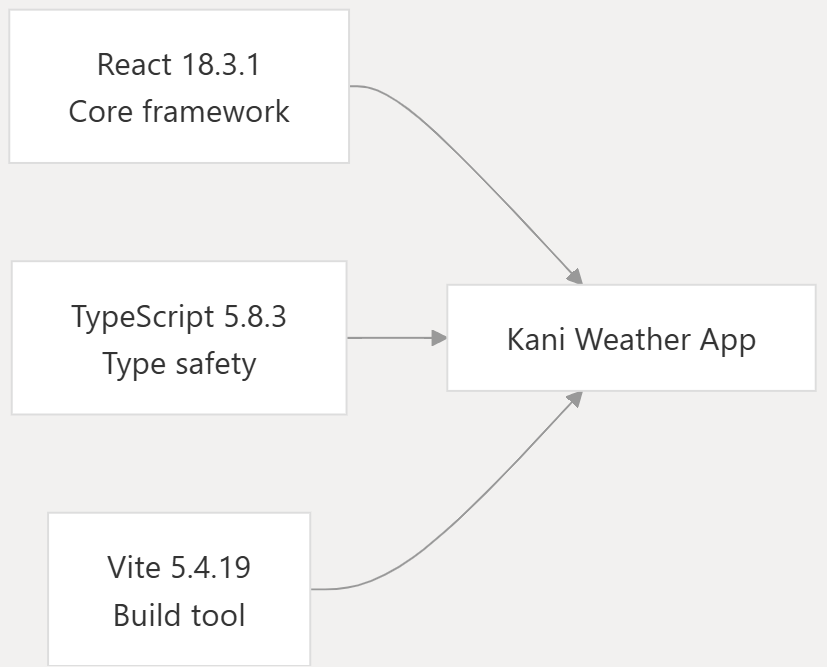
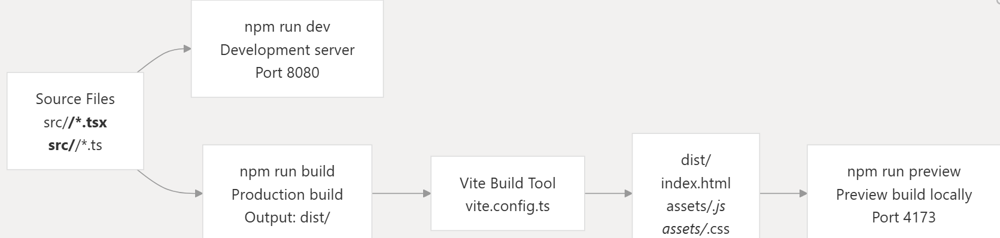

# KANI: Weather Alert App

# Overview
This document provides an introduction to the Kani Weather App Alert, a climate resilience platform designed for vulnerable communities in Colombia. It covers the application's mission, core capabilities, technology stack, and high-level architecture. For detailed information about specific subsystems, see Application Architecture, Core Features, and Deployment Infrastructure.

If you want to know more about the research and application behind it, please refer to our paper: [Plataforma Accesible para Alertas Tempranas Hidrometeorologicas Basada en Pronósticos Climáticos y Umbrales Locales de Precipitación](https://github.com/DCajiao/kani-weather-app-alert/blob/main/docs/Plataforma%20Accesible%20para%20Alertas%20Tempranas%20Hidrometeorologicas%20Basada%20en%20Pron%20%C2%B4%20osticos%20%C2%B4%20Climaticos%20y%20Umbrales%20Locales%20de%20Precipitaci%20%C2%B4%20on.pdf).

# Key Features
The platform provides five primary functional areas, each accessible through bottom navigation:


| Feature | View Component | Primary Purpose | Key APIs Used |
| ------------- | ------------- | ------------- | ------------- |
| Weather Dashboard |	HomeView |	Current weather and risk status |	Geolocation, Nominatim, Open-Meteo |
| Weather Alerts |	AlertsView |	7-day forecast with alert rules |	Open-Meteo, Web Speech API |
| Risk Map |	MapView |	Visual risk zones and POIs |	Geolocation, Nominatim, Open-Meteo |
| Emergency Kit  | PrepareView |	Interactive preparedness checklist |	Web Speech API |
| Incident Reports |	ReportView |	Community reporting with media |	Geolocation, Nominatim, FormSubmit.co |

Each feature operates independently, with the Index component managing navigation state through the activeTab state variable

# Architecture / Tech Stack

## Frontend Framework


## Core Dependencies:

- React 18.3.1: Component-based UI framework with hooks-based state management
- TypeScript 5.8.3: Static type checking for improved code reliability
- Vite 5.4.19: Fast development server and optimized production builds
- React Router DOM 6.30.1: Client-side routing (though the app uses tab-based navigation)

## External Service Integrations

| Service | Purpose	| Integration Point	| Configuration |   
| ------------- | ------------- | ------------- | ------------- |
| Browser Geolocation API |	User location detection |	navigator.geolocation |	Fallback: Cali, Colombia (3.4516°N, 76.5320°W) |
| Nominatim OSM API |	Reverse geocoding |	nominatim.openstreetmap.org	| Language: Spanish (accept-language=es) |
| Open-Meteo API |	7-day weather forecasts |	api.open-meteo.com	| Hourly data: 168 hours |
| FormSubmit.co |	Email dispatch |	formsubmit.co |	Recipients: authorities, coordinators |
| Web Speech API |	Text-to-speech | speechSynthesis |	Language: Spanish (es-ES), Rate: 0.9 |

# Usage
## Prerequisites
Before deploying the application, ensure the following tools and resources are available:

| Requirement |	Version | Purpose |
| ------------- | ------------- | ------------- |
| Docker |	≥20.10 |	Container runtime for building and running images |
| Docker Compose |	≥2.0 (optional) |	Orchestration for multi-container setups |
| Git |	Any |	Source code version control |
| Network Access |	- |	Required for npm dependencies and external API calls |

## System Requirements:
* Minimum 2GB RAM for Docker build process
* Minimum 500MB free disk space for build artifacts
* Port 80 available for HTTP traffic (or configurable alternative)

External Dependencies: The application requires network connectivity to external services at runtime:

* Open-Meteo API (api.open-meteo.com)
* Nominatim OSM API (nominatim.openstreetmap.org)
* FormSubmit.co (formsubmit.co)
* Browser-based APIs (Geolocation, Web Speech)

## Docker Build Command Mapping


## Running the Container Locally (Docker)
```bash
# Run container on default port 80
docker run -d -p 80:80 --name kani-weather kani-weather-app:latest

# Run on custom port 8080
docker run -d -p 8080:80 --name kani-weather kani-weather-app:latest

# View logs
docker logs kani-weather

# Stop container
docker stop kani-weather
```

## Manual Build Steps
For non-Docker deployments, use the following commands:

```bash
# Install dependencies
npm install

# Run the app
npm run dev
```

If you want to learn more about how the code works or see more comprehensive documentation, you can check out this [tool](https://deepwiki.com/DCajiao/kani-weather-app-alert). 

# Authors / Maintainers
- Researcher: [Camila Cardona](https://www.github.com/Camiau20)
- Developer: [David Cajiao](https://www.github.com/DCajiao)
